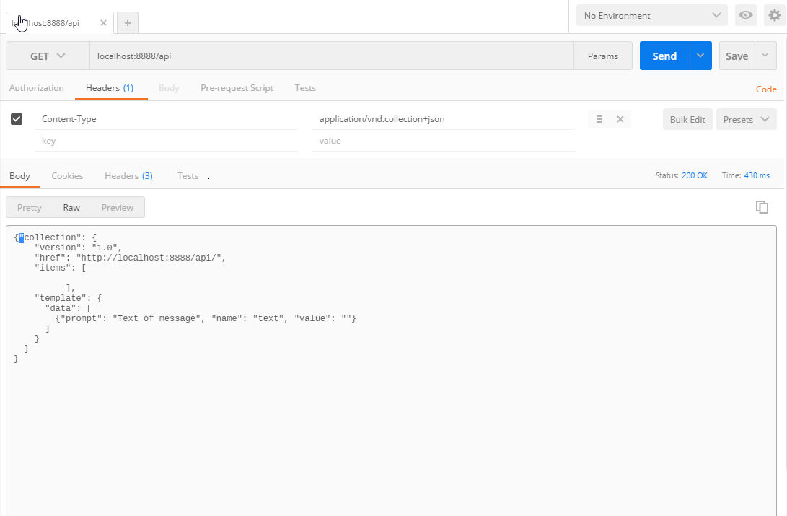
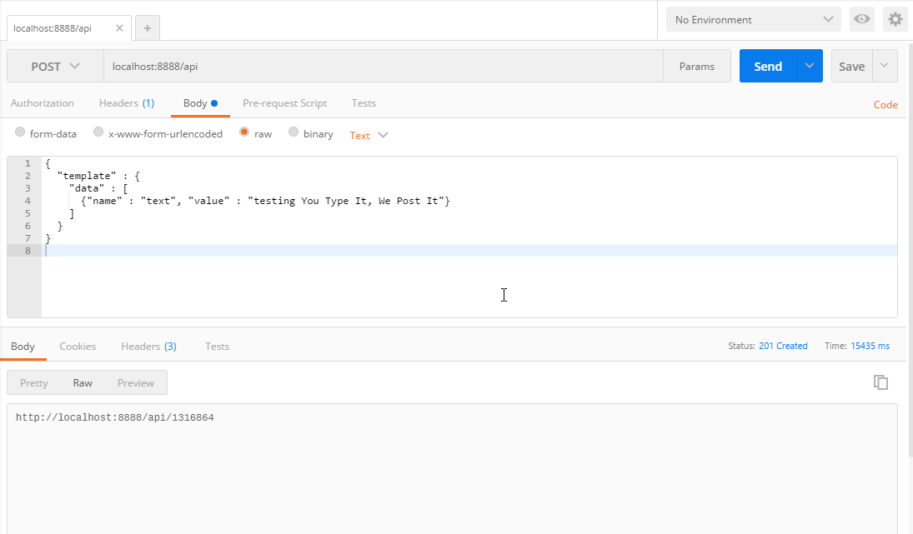
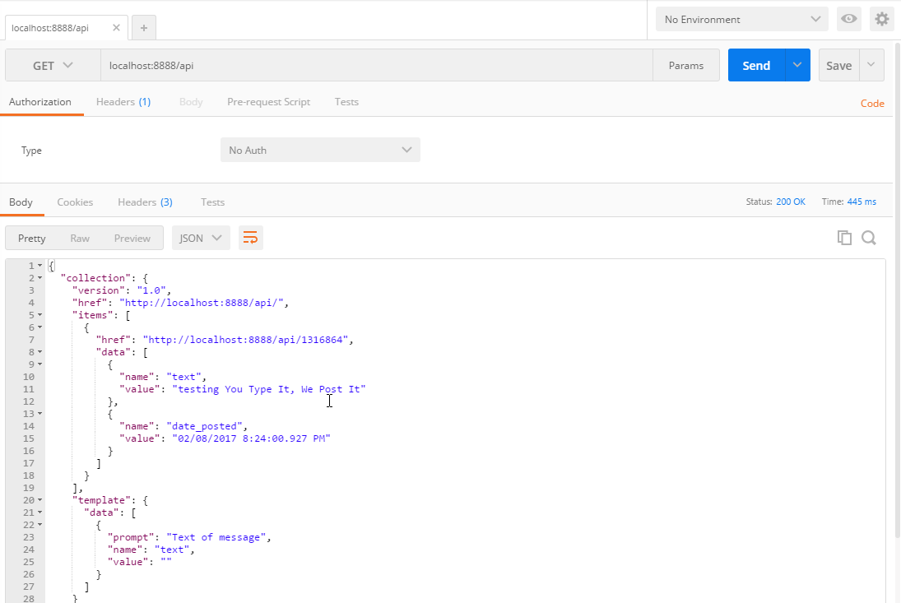

Example from RESTful Web APIs [http://restfulwebapis.org/ytiwpi.html]


EiffelWeb code for the examples in O'Reilly's "RESTful Web APIs".

You Type It, We Post It
-----------------------
<table>
    <tr>
        <td>/YouTypeIt/</td>
        <td>A microblogging website with a programmable
            Collection+JSON API</td>
    </tr>
</table>

WebSite, Programmable API URIs
------------------------------

<table>
    <tr>
        <td>http/localhost:8888</td>
        <td>Microblogging web site</td>
    </tr>
    <tr>
        <td>http/localhost:8888/api</td>
        <td>Collection+JSON API</td>
    </tr>
</table>


Using the Collection+JSON API
-----------------------------
To test the programmable API you can use an HTTP client (curl for example) or Postman [https://www.getpostman.com/]
 
In the following image we show how to access the root of the programable API.  `GET http://localhost:8888/api` 
as a response we get a response with Collection+JSON format. 
 

Post a new message using the API, to do that we will need to send a POST request using the Collection+JSON template format
``` 
{
  "template" : {
    "data" : [
      {"name" : "text", "value" : "testing You Type It, We Post It"}
    ]
  }
}
```
In the image we can see the response status 201, that means the resource was created.  
 

Finally we can get the root resource and we will see the previous created message as part of it, also you can navigate to a particular
message doing a request like that `GET GET http://localhost:8888/api/${messsageid}` where messageid is the unique id representing a message.
 
