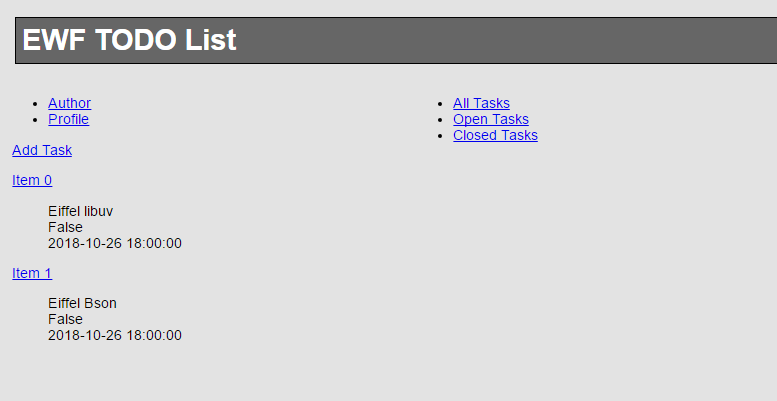

Hypermedia API Example
===

Based on Mike Amundsen book [
Building Hypermedia APIs with HTML5 and Node](http://shop.oreilly.com/product/0636920020530.do), 
[source code of the book](https://github.com/mamund/Building-Hypermedia-APIs) 

To learn more about REST and Hypermedia-API please check the following resources
* [REST APIs must be hypertext-driven](http://roy.gbiv.com/untangled/2008/rest-apis-must-be-hypertext-driven)
* [Hypermedia Controls](http://blueprintforge.com/blog/2012/01/01/a-short-explanation-of-hypermedia-controls-in-restful-services/)
* [Richardson Maturity Model](https://martinfowler.com/articles/richardsonMaturityModel.html)

Project Structure
---
At the moment EWF does not use [convention over configuration](http://en.wikipedia.org/wiki/Convention_over_configuration), so every project will have his own structure, here is the breakdown for the app example

 - **pragmatic_rest**
   - **src**  -- Source code cluster.
      - **root**   --  root application able to launch the app with either cgi, libfcgi, or nino connector.  
        - **any**     -- launch the app with either cgi, libfcgi, or nino connector.     
        - **default** -- launch the application using nino connection.
      - **handler** -- Handlers to manage specific uris defined in *PRAGMATIC_REST_SERVER*. 
      - **utils**   -- Utils classes.
      - **HYPERMEDIA_REST_SERVER**
   - **www**  -- document root containing html pages, js and css files needed by the application
   - **api_rest-safe.ecf** -- Eiffel configuration file

Application Architecture
--
Before to see our custom implemtation for our example, it's recomended to see the basic application architecture and the common lifecyle that every ewf application will have. So first read the wiki page [application lifecycle] (https://github.com/EiffelWebFramework/ewf_examples/wiki/Application-Lifecycle)

